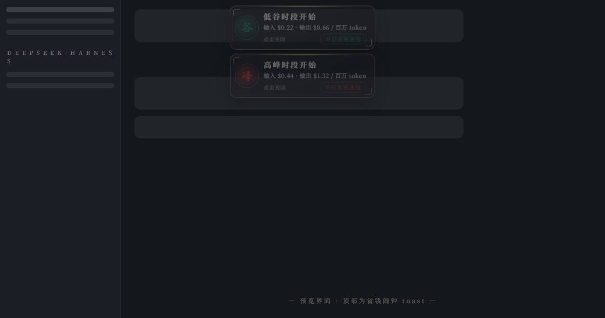
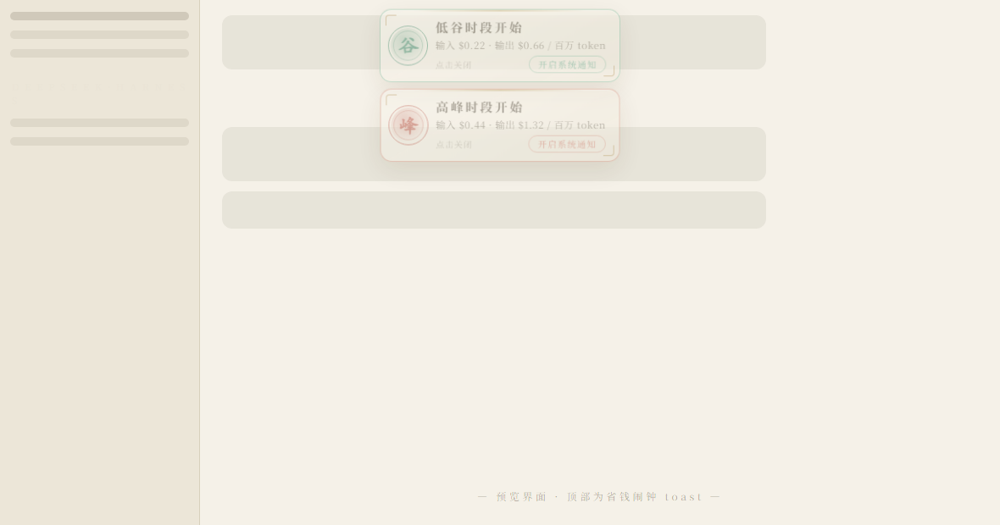

# peak-valley-alarm

> 省钱闹钟 —— 低谷/高峰时段切换，第一时间提醒你



一个运行在 **DeepSeek Harness Web GUI** 的省钱小助手：按**北京时间**盯着峰谷计价时段，每当 **低谷（谷）** 或 **高峰（峰）** 切换时：

- 页面顶部弹出**国风 toast 横幅**（与 [peak-valley-ticker](https://github.com/Leonx01/peak-valley-ticker) 同款印章美学，点击即可关闭）
- 播放 **WebAudio 生成的国风提示音**（谷=清脆双音磬，峰=三音锣，无需任何音频文件）
- 发送**浏览器系统通知**（未授权时 toast 内提供「开启系统通知」按钮，一次点击授权）

toast 与通知里还会显示**当前输入 / 输出 token 单价**（按提醒发生时的峰/谷时段取价）。**DeepSeek API 剩余余额**常驻显示在 [peak-valley-ticker](https://github.com/Leonx01/peak-valley-ticker) 行情条中。

## 界面效果

暗色主题（默认）：


亮色主题：



## 提醒内容

| 切换 | 通知标题 | 正文 |
| --- | --- | --- |
| → 低谷（12:00 / 18:00） | 低谷时段开始 | 输入 $0.22 · 输出 $0.66 / 百万 token |
| → 高峰（09:00 / 14:00） | 高峰时段开始 | 输入 $0.44 · 输出 $1.32 / 百万 token |

toast 与通知里的文案只展示**当前输入 / 输出 token 单价**（按当前峰/谷时段取价，峰时 = 谷时 × 2），不再包含峰谷计价、北京时间、倍率、半价等描述。示例价格基于官方当前价目（2026-08-16 起峰谷计价，美元 / 百万 token），可在 `prices` 配置中覆盖。

## 价格

默认值为 DeepSeek 官方谷时价（`inputCacheMiss` / `inputCacheHit` / `output`，美元每百万 token），`peakMultiplier` 用于峰时取价（默认 2）。当前显示的价格按提醒发生时的峰/谷时段取价。

## 时段规则（北京时间）

默认高峰时段为 **09:00–12:00、14:00–18:00**，其余时间为低谷时段——与 `peak-valley-ticker` 完全一致的规则。

profile 的 `cordis.patch.yml` 配置示例：

```yaml
- insert:
    - id: peak-valley-alarm
      name: 'peak-valley-alarm'
      config:
        peakWindows:      # 高峰时段（小时制），其余为低谷
          - [9, 12]
          - [14, 18]
        sound: true       # 提示音开关
        notify: true      # 系统通知开关
        toastSeconds: 8   # toast 停留秒数
        demo: false       # 设为 true：加载 4 秒后模拟一次「低谷开始」提醒，方便预览
        prices:           # 官方谷时价（美元/百万 token），峰时自动 × peakMultiplier
          inputCacheMiss: 0.22   # 输入（未命中缓存）
          inputCacheHit: 0.007   # 输入（命中缓存）
          output: 0.66           # 输出
          peakMultiplier: 2      # 峰时倍数
          currency: '$'          # 价格货币符号
```

注意：patch 会**整体替换**该行的 `config`，修改时需完整重写所有键。

## 安装

```bash
# 方式一：从仓库直接安装（pnpm 支持 git 依赖）
dsh plugin --profile web add github:Leonx01/peak-valley-alarm

# 方式二：克隆后本地安装
git clone https://github.com/Leonx01/peak-valley-alarm
dsh plugin --profile web add file:D:/path/to/peak-valley-alarm
```

挂载到 profile 后重启 `dsh web`。想立刻看效果，把配置里 `demo` 改为 `true` 再重启一次即可。

## 结构

| 文件 | 说明 |
| --- | --- |
| `lib/index.js` | 宿主半部：注册 `/peak-valley-alarm/balance` 余额代理路由（凭据解析 + 官方余额接口转发，密钥不出宿主） |
| `lib/client.js` | 已构建的客户端 bundle（`window.__ModuleLoader__.load` 惰性 CJS 格式），注册 `shell.overlay` 列表槽位（切换 toast + 余额/价格角标） |
| `package.json` | `dsh.client.platform: "web"` 声明客户端半部 |
| `docs/preview.html` | 独立预览页（模拟 DSH Web 明暗界面），用于生成 README 截图 |
| `scripts/generate-preview.js` | 从 `lib/client.js` 抽取插件 CSS 注入预览页，保证截图与发布版本一致 |

客户端仅依赖 seed 模块 `react` 与运行时提供的 `slots` 服务；样式以 `<style data-plugin>` 注入，插件卸载时由平台自动回收。提示音用 WebAudio 实时合成（首次交互后解锁，遵循浏览器自动播放策略）。

## 开发 / 重新生成截图

```bash
node scripts/generate-preview.js   # 重新注入最新 CSS 到 docs/preview.html
# 然后用无头浏览器截图：
#   msedge --headless=new --screenshot=docs/screenshot-dark.png \
#     --window-size=1180,620 "file:///.../docs/preview.html?theme=dark&state=both"
```

## License

[MIT](LICENSE) © Leonx01
